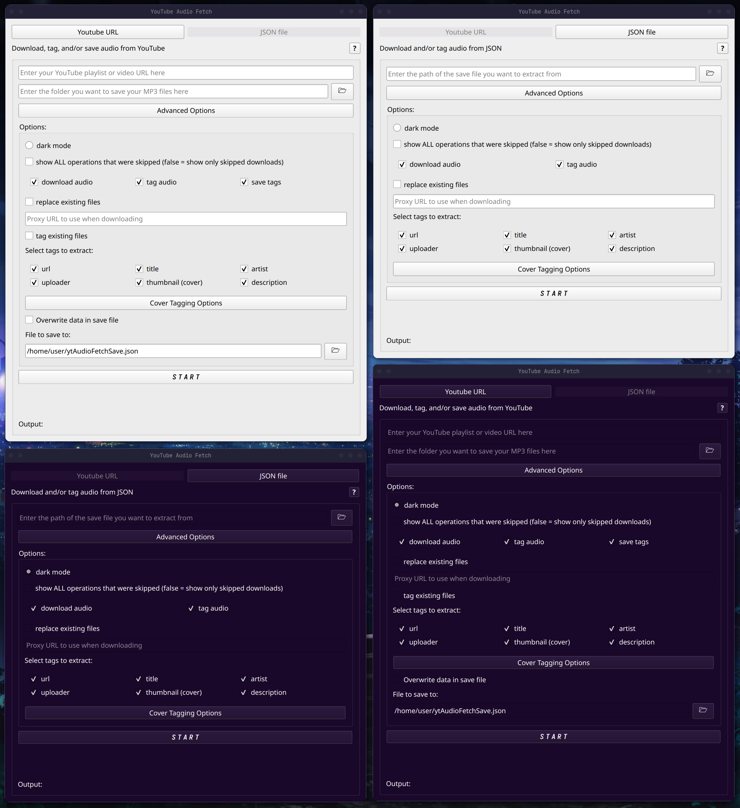

<table style="width: 100%; border-collapse: collapse; border: none;">
  <tr style="border: none;">
    <td style="vertical-align: top; border: none;">
      <h1>ytAudioFetch</h1>
      <p>Light <a href="https://github.com/yt-dlp/yt-dlp">yt-dlp</a> GUI that fetches the audio from any YouTube playlist, video, or short while tagging it with any of the tags you can choose.</p>
    </td>
    <td style="text-align: right; vertical-align: top; width: 120px; border: none;">
      
    </td>
  </tr>
</table>


## Installation
### Download Installer
If you're on windows you can just download the installer from the [releases page](https://github.com/DryPringleSoup/ytAudioFetch/releases).

### Command Line
0. Make sure you have [git](https://git-scm.com/), [python](https://www.python.org/), and [ffmpeg](https://www.ffmpeg.org/) installed
   - On Windows
   ```bash
   winget Git.Git python ffmpeg
   ```
   - On Linux (most distros) ((if this doesn't work look up your distro's package manager installation instructions))
   ```bash
   sudo <package-manager> install git python3-pip ffmpeg
   ```

1. Clone repository:
   ```bash
   git clone https://github.com/DryPringleSoup/ytAudioFetch.git
   ```

2. Enter into directory
   ```bash
   cd ytAudioFetch
   ```

3. Create virtual environment
   ```bash
   python -m venv ytafenv
   ```
4. Activate environment
  - On Windows
     ```bash
     ytafenv\Scripts\Activate.ps1
     ```
  - On Linux
     ```bash
     source ytafenv/bin/activate
     ```

5. Install dependencies
   ```bash
   pip install -r requirements.txt
   ```

6. Run GUI
   ```bash
   python3 ytAudioFetchGUI.py
   ```
   - you can also run this script without the GUI by typing: `python3 ytAudioFetch.py`

#### Copy and paste
- Windows
    ```bash
    winget install Git.Git python ffmpeg
    git clone https://github.com/DryPringleSoup/ytAudioFetch.git
    cd ytAudioFetch
    python -m venv ytafenv
    ytafenv\Scripts\Activate.ps1
    pip install -r requirements.txt
    python3 ytAudioFetchGUI.py
    ```

- Linux
    ```bash
    git clone https://github.com/DryPringleSoup/ytAudioFetch.git
    cd ytAudioFetch
    python -m venv ytafenv
    source ytafenv\bin\activate
    pip install -r requirements.txt
    python3 ytAudioFetchGUI.py
    ```

## Guide


1. **[URL Mode](#URLmode)** - this is the main mode, it allows to download any playlist's or video's audio
2. **[JSON Mode](#JSONmode)** - using your own custom JSON file, you can put in your own tag data and have all the specified files be tagged
3. **Help Button** - opens up this guide in your browser
4. **Youtube URL to extract from** - non-private playlist or single videos (this includes shorts) are valid
5. **Directory/Folder to save to** - you can either manually type it or press the folder icon and browse to find it
6. **Advanced options toggle** - hides and unhides advanced options
7. **Dark Mode activator** - changes the theme to dark mode (see last image for previews)
8. **Verbose skip list** - Normally, when the program is done processing, it shows a list of any videos/json entries whose downloads were skipped; turning on this will show all operations that were skipped like skipped tags and skipped saves. This often makes the list much longer
9. **Download operation<sup>[[1]](#fn1)</sup>** - whether or not to download the audio file
10. **Tag operation** - whether or not to tag the audio file with tags checked in 15-20
11. **Save operation** - whether or not to save the tag data to a JSON file
12. **Replacing files** - replace existing files with the same name, works by checking if a file has the format "YTAF-[id]-[title].mp3" (with the same id and title). This means, if you change the file name, the original will not be replaced
13. **Proxy URL** - if want to use a proxy server to redirect requests, enter its URL here, otherwise leave blank
14. **Tag existing** - uses the same check as 12 to determine existing files. When turned off, skips tagging if the file already exists
15. **Youtube URL tag** - gets saved to the WOAS (sourceURL) ID3 tag
16. ***Title tag<sup>[[2]](#fn2)</sup>** - gets saved to the TIT2 (title) ID3 tag
17. ***Artist tag<sup>[[2]](#fn2)</sup>** - gets saved to the TPE1 (artist) ID3 tag
18. ***Uploader tag** - gets saved to the TPUB (publisher) ID3 tag
19. ***Thumbnail tag<sup>[[1]](#fn1)</sup>** - gets saved to the APIC (picture) ID3 tag
20. ***Description tag<sup>[[1]](#fn1)</sup>** - gets saved to COMM (comment) ID3 tag
      - *A comprehensive list of ID3 tags can be found with descriptions can be found [here](https://id3.org/id3v2-00) or, for a more concise list, [here](https://exiftool.org/TagNames/ID3.html)
21. **Cover options toggle** - hides and unhides cover options; these options are only used if tagging (10) is enabled and the thumbnail tag (19) is enabled
22. **Clear covers<sup>[[3]](#fn3)</sup>** - clears all existing, embedded covers tagged on the mp3 file
23. **Cover save path** - folder to save the covers that get tagged onto the mp3 or cleared, leave blank to not save
24. **Compression quality slider<sup>[[4]](#fn4)</sup>** - controls the compression quality when converting thumbnails to JPG to be tagged onto the mp3, slide the slider to increase or decrease the quality or use the left and right buttons on the side of the slider to increment or decrement by 1. Also, it should be noted that [qualities above 95 have diminishing return and may lead to large files](https://pillow.readthedocs.io/en/stable/handbook/image-file-formats.html#jpeg-saving).
25. **Overwrite Save** - overwrite the tags saved in the entry for that file in the JSON file that put in 26
26. **Save file path** - where to save the JSON file, you can either manually type it or press the folder icon and browse to find it. If left blank, it will save to ytAudioFetchSave.json in the user folder
27. **Start button** - begin the script in the current mode
28. **Status feed** - updates as the script runs; shows the current video being processed and, when finished, the list of skipped operations
29. **Output feed** - updates as the script runs; shows the console output from the script

#### <span id="fn1"></span>
   - *Note for 9, 19, and 20<sup>1</sup>*: downloading videos or extracting thumbnails/descriptions information requires the extractor to download the audio the full webpage info which can make fetching large playlists very slow. If all you want is to tag/save the other tags, turn off downloading, thumbnails, and descriptions for a much faster extraction. <span id="fn4"> Generally, minizing any unneeded downloading from the internet makes processing faster. So, for example, if you're in JSON mode and you only really want to retag existing files, turn off downloading and if you also don't need to change the thumbnails, turn that off since most of the time the thumbnails are saved as links that have to be downloaded. It should also be made clear that tagging descriptions in JSON mode doesn't really the slow down that it does with URL mode because it's already saved locally and it doesn't have to download the full webpage to get it.</span>
#### <span id="fn2"></span>
   - *Note for 16 and 17<sup>2</sup>*: when the original youtube title in the form "*this* - *that*", it gets parsed as "*artist* - *title*", otherwise the title is just the original title and the artist is just the channel name (I know this is not a perfect solution but it works a good 7 / 10 times so I don't particularly care enough to think of something more convoluted). Also, if the artist is the channel name, it removes the " - Topic" suffix from autogenerated YouTube Music tracks.
#### <span id="fn3"></span>
   - *Note for 22<sup>3</sup>*: this is useful because the tagged covers automatically get sorted by image size in ascending order which causes the smallest cover to be always be shown first even if you added bigger cover images later. To my knowledge, there is no way of changing this order which is really annoying.

<br>


1. **Json file to extract from** - you can either manually type it or press the file icon and browse to find it
   - json files should be formatted like this
    ```json
    {
        "...": { },
        "[file path to mp3]": {
            "url": "[non-private youtube URL (playlist URLs don't work)]",
            "title": "[track title]",
            "artist": "[artist(s)]",
            "uploader": "[uploader]",
            "thumbnail": "[file path to image or raw link to image file]",
            "description": "[description]"
        },
        "...": { }
    }
    ```
   - *Note*: not all tags are required to be included, however only supported tags (see 15-20) will be added
2. ***((Everything else function as if in [URL mode](#URLmode)))***

- *Note when tagging using JSON mode*: refer to the <a href="#fn4">ladder half</a> of note 1 in url mode

## App Previews
### GUI


### Original script
```bash
python ytAudioFetch.py
```
```
URL or JSON mode? (0 or 1): 0
Operations:
        d: Download audio       t: Tag audio    s: Save tags
Include the letters for each of operation you want to perform: dts
Available tags:
        1: url
        2: title
        3: artist
        4: uploader
        5: thumbnail
        6: description
Enter the tags you want to change: 123456
Enter the YouTube playlist/video URL: https://www.youtube.com/playlist?list=PLUujrJZl_60rr9OQMLSzHvrbIX0dCen-i
Enter the directory to save the MP3 files: ~/Music
Enter the path of the JSON save file: ~/ytAudioFetchSave.json
Replace existing files? (y/n): y
Enter the proxy URL (leave empty for no proxy): http://192.168.69.70:8888
tag existing files? (y/n): y
Clear existing covers? (y/n): y
Enter the directory to save the cover images (leave empty to not save covers): ~/ytAudioFetchCovers
*Values over 95 result in higher file sizes with a diminishing return on quality*
Enter the cover quality (0-100): 70
Overwrite data in save file? (y/n): y
Verbose skip list (show all operations skipped)? (y/n): y
```
```
URL or JSON mode? (0 or 1): 1
Operations:
        d: Download audio       t: Tag audio
Include the letters for each of operation you want to perform: dt
Available tags:
        1: url
        2: title
        3: artist
        4: uploader
        5: thumbnail
        6: description
Enter the tags you want to change: 123456
Enter the YouTube playlist/video URL: ~/ytAudioFetchSave.json
Replace existing files? (y/n): y
Enter the proxy URL (leave empty for no proxy): http://192.168.69.70:8888
Clear existing covers? (y/n): y
Enter the directory to save the cover images (leave empty to not save covers): ~/ytAudioFetchCovers
*Values over 95 result in higher file sizes with a diminishing return on quality*
Enter the cover quality (0-100): 70
Verbose skip list (show all operations skipped)? (y/n): y
```