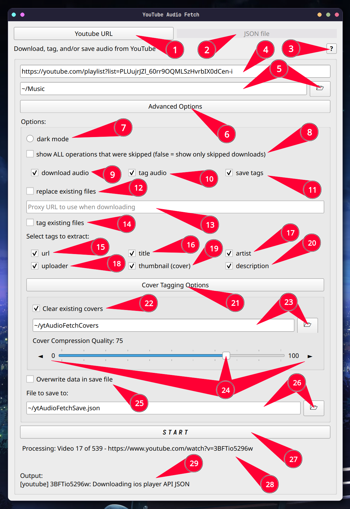

# ytAudioFetch 
Light [yt-dlp](https://github.com/yt-dlp/yt-dlp) gui that fetches the audio from any youtube playlist, video, or short while tagging it with any of the tags you can choose.

## Installation
### Command Line
1. Clone repository:
   ```bash
   git clone https://github.com/DryPringleSoup/ytAudioFetch.git
   ```

2. Create virtual environment
   ```bash
   python -m venv ytafenv
   ```
3. Activate environment
  - On Windows
     ```bash
     ytafenv\Scripts\activate
     ```
  - On Linux
     ```bash
     source ytafenv/bin/activate
     ```

4. Install dependencies
   ```bash
   pip install -r requirements.txt
   ```

5. Run GUI
   ```bash
   python ytAudioFetchGUI.py
   ```
   - you can also run this script without the GUI by typing: `python ytAudioFetch.py`

#### Copy and paste
- Windows
    ```bash
    git clone https://github.com/DryPringleSoup/ytAudioFetch.git
    python -m venv ytafenv
    ytafenv\Scripts\activate
    pip install -r requirements.txt
    python ytAudioFetchGUI.py
    ```

- Linux
    ```bash
    git clone https://github.com/DryPringleSoup/ytAudioFetch.git
    python -m venv ytafenv
    source ytafenv\bin\activate
    pip install -r requirements.txt
    python ytAudioFetchGUI.py
    ```

## Guide


1. **URL Mode** - This is the main mode, it allows to download any playlist's or video's audio
2. **JSON Mode** *(More info below next image)* - Using your own custom JSON file, you can put in your own tag data and have all the specified files be tagged
3. **Youtube URL to extract from** - playlist or single videos (this includes shorts) are valid
4. **Directory/Folder to save to** - you can either manually type it or press the folder icon and browse to find it
5. **Advanced options toggle** - Hides and unhides advanced options
6. **Dark Mode activator** - changes the theme to dark mode (see last image for previews)
7. **Verbose skip list** - Normally, when the program is done processing, it shows a list of any videos/json entries whose downloads were skipped; turning on this will show all operations that were skipped like skipped tags and skipped saves. This often makes the list much longer
8. ***Download operation** - whether or not to download the audio file
9. **Tag operation** - whether or not to tag the audio file with tags checked in 13-17
10. **Save operation** - whether or not to save the tag data to a JSON file
11. **Replacing files** - replace existing files with the same name, works by checking if a file has the format "YTAF-[id]-[title].mp3" (with the same id and title). This means, if you change the file name, the original will not be replaced
12. **Tag existing** - uses the same check as 11 to determine existing files. When turned off, skips tagging if the file already exists
13. **Youtube url tag** - gets saved to the WOAS (sourceURL) ID3 tag
14. ****Title tag** - gets saved to the TIT2 (title) ID3 tag
15. ****Artist tag** - gets saved to the TPE1 (artist) ID3 tag
17. ***Thumbnail tag** - gets saved to the APIC (picture) ID3 tag
18. ***Description tag** - gets saved to COMM (comment) ID3 tag
19. **Save file path** - where to save the JSON file
20. **Start button** - begin the script in the current mode
21. **Status feed** - updates as the script runs; shows the current video being processed and, when finished, the list of skipped operations
22. **Output feed** - updates as the script runs; shows the console output from the script
   - **Note for 8, 16, and 17*: downloading videos or extracting thumbnails/descriptions information requires the extractor to download the audio the full webpage info which can make fetching large playlists very slow. If all you want is to tag/save the other tags, turn off downloading, thumbnails, and descriptions for a much faster extraction
   - ***Note for 14 and 15*: when the original youtube title in the form "*this* - *that*", it gets parsed as "*artist* - *title*", otherwise the title is just the original title and the artist is just the channel name (I know this is not a perfect solution but it works a good 7 / 10 times so I don't particularly care enough to think of something more convoluted). Also, if the artist is the channel name, it removes the " - Topic" suffix from autogenerated YouTube Music tracks.

<br>


1. **Json file to extract from**
   - json files should be formatted like this
    ```json
    {
        "...": { },
        "[file path to mp3]": {
            "url": "[youtube URL (playlist URLs don't work)]",
            "title": "[track title]",
            "artist": "[artist(s)]",
            "uploader": "[uploader]",
            "thumbnail": "[file path to image or raw link to image file]",
            "description": "[description]"
        },
        "...": { }
    }
    ```
   - *Note*: not all tags are required to be included, however only supported tags (see 13-17) will be added

## App Previews
### GUI


### Original script
```bash
python ytAudioFetch.py
```
```
URL or JSON mode? (0 or 1): 0
Operations:
        d: Download audio       t: Tag audio    s: Save tags
Include the letters for each of operation you want to perform: dts
Available tags:
        1: url
        2: title
        3: artist
        4: uploader
        5: thumbnail
        6: description
Enter the tags you want to change: 123456
Enter the YouTube playlist/video URL: https://www.youtube.com/playlist?list=PLUujrJZl_60rr9OQMLSzHvrbIX0dCen-i
Enter the directory to save the MP3 files: ~/Music
Enter the path of the JSON save file: ~/ytAudioFetchSave.json
Replace existing files? (y/n): y
tag existing files? (y/n): y
Overwrite data in save file? (y/n): y
Verbose skip list (show all operations skipped)? (y/n): y
```
```
URL or JSON mode? (0 or 1): 1
Operations:
        d: Download audio       t: Tag audio
Include the letters for each of operation you want to perform: dt
Available tags:
        1: url
        2: title
        3: artist
        4: uploader
        5: thumbnail
        6: description
Enter the tags you want to change: 123456
Enter the YouTube playlist/video URL: ~/ytAudioFetchSave.json
Replace existing files? (y/n): y
Verbose skip list (show all operations skipped)? (y/n): y
```